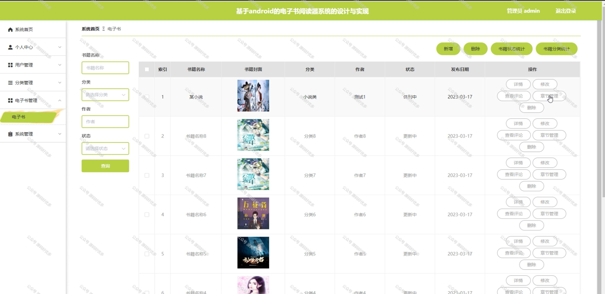

 
## 查看主页获取源码

> **作者介绍**： **✌**全网粉丝10W+本平台特邀作者、博客专家、CSDN新星计划导师、java领域优质创作者,博客之星、掘金/华为云/阿里云/InfoQ等平台优质作者、专注于项目实战 **✌**

  

### 一、作品包含

源码+数据库+全套环境和工具资源+部署教程

### 二、项目技术

前端技术：Html、Css、Js、Vue、Element-ui

数据库：MySQL

后端技术：Java、Spring Boot、MyBatis

  

### 三、运行环境

开发工具：IDEA/eclipse + 微信开发者工具

数据库：MySQL5.7

数据库管理工具：Navicat10以上版本

环境配置软件： JDK1.8+Maven3.6.3

前端Nodejs：14

### 四、项目介绍
项目编号：mpweixinA035

随着数字化阅读的普及，电子书阅读器小程序应运而生，为用户提供了便捷的电子书阅读体验。这款小程序集成了丰富的电子书资源，包括各类经典文学作品、专业书籍、网络小说等，满足用户多样化的阅读需求，使用户在阅读过程中更加便捷和高效。让用户可以随时随地畅享阅读乐趣。总的来说，电子书阅读器小程序为用户提供了便捷、丰富的电子书阅读体验，满足了现代人快节奏生活中对阅读的需求。

前台用户功能：登录注册、首页、个人中心、资讯、电子书、我的收藏、在线客服。

后台管理员的功能：系统首页、个人中心、用户管理、分类管理、电子书管理、系统管理。

### 五、运行截图

  
